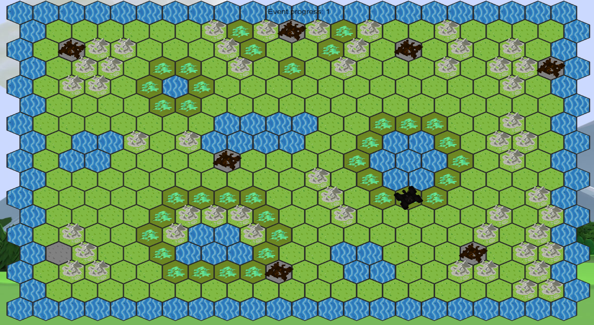
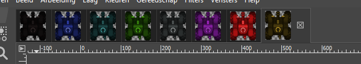

# Game

## Setup

Clone project and install dependencies with 

```shell
npm install
```

You can create a `.env` file that contains the configuration for the application to run. (see `.env.example` for an example configuration)

## Running development setup

```shell
npm run dev
```

This will start a server on [http://localhost:3000](http://localhost:3000), and will watch JavaScript files for changes and will recompile them when changed.

## Building production sources

```shell
npm run build-prod
```

This will only build the JavaScript files into the `/dist` directory. The compiled files will be optimized for production environments.

## 1. Uitleg

We maken een spel met gebruik van phaser. Het spel gaat een oorlogsspel zijn waarbij iedere speler (max 8) een eigen tank bestuurt. De bedoeling dan om je tegenstanders uit te schakelen. Op deze tank kan je uitbreiden speciale eigenschappen. Deze eigenschappen kan je kiezen door op je controller dongles in te pluggen. Zo zijn er specificaties die je kan kiezen namelijk de soort tank, je wapen, je armor en de boost die je tank heeft. Het voordeel hiervan is dat je zelf je tank kan samenstellen uit en hele soort mogelijkheden. Maar naast de dongles voor je de eigenschappen van je tank heb je ook een dongle met je eigen gegevens. Dit is gemakkelijk want dan kan je overal spelen met je eigen account zonder dat het lang duurt totdat je met je eigen account ingelogd bent.

## 2. Terrein

Het terrein waarop het spel gespeeld wordt is onderverdeeld in hexagon’s. In de map worden zijn er dan obstakels waar niet alle tanks doorheen kunnen. Er zijn zo bijvoorbeeld bossen of moerassen of bergen.



## 3. Basic stats

    • Movement
        o Men kan maar 1 vakje bewegen per turn.
    • Health
        o Iedere tank start met 100hp.
    • Armor
        o Iedere tank start met 0 armor.
    • Weapon
        o Alle tanks hebben 1 standaard wapen.

## 4. Tanks

Iedere speler heeft een eigen tank met een van deze kleuren.


## 5. Wapens

    • Flammenwerpfer:
        o Range: 3 hexes line LoS
        o Damage: 8
        o Special: BURN BURN BURN: next turn 5 damage

    • Laser:
        o Range: line LoS unlimited
        o Damage: 3

    • Plasma gun:
        o Range: 90% max 3 hexes
        o Damage: 6

    • Ram:
        o Range: Close range
        o Damage: 16

## 6. Extra boosts + dongels

    • Shield:
        o Armour +25

    • Movement boosts:
        o Rocket engine: movement +3
        o Harrier: jump 6 hexes once every 3 turns, can only jump into clear terrain, ignores terrain in between
        o Amphibious: may enter water

    • Mines (5)
        o Bury 1 mine on a hex
        o When a bot enters a hex, mine deals 10 damage, discard mine afterwards

    • EMP bomb
        o Range: all adjacent hexes
        o Special: Disable 1 item for the next turn, mines are also disabled

## 7. Hoe starten ?

1. Log in op github ga naar BUG dan naar game-frontend.
2. Klik op clone kopieer dan de SSH link.
3. Ga naar een bestand in je laptop/pc open powershell en doe git clone en de SSH link.
4. Open dan game-frontend met Visual Studio Code.
5. Druk op ctrl+ù en type dan: php -S localhost:8000 .

* Docker

1. Open docker quickstart terminal
2. go to directory where the file "docker-compose.yml" is located
3. then use command: 'docker-compose up' to start the game on the ip addres you received from docker on port 8080.

## 8. Gameplay

    • Black Tank
        o Vooruit -> Z
        o Achteruit -> S
        o Links -> Q
        o Rechts -> D

    • Yellow Tank
        o Vooruit -> ↑
        o Achteruit -> ↓
        o Links -> ←
        o Rechts -> →

    • Blue Tank
        o Vooruit -> O
        o Achteruit -> L
        o Links -> K
        o Rechts -> M
    • Truns
        o Move then fire

## 9. Spellocatie

Het is de bedoeling om de game op een site te laten draaien zodanig dat je tijdens het gamen kunt veranderen van toestel. Dit is gemakkelijk voor als je plots je scherm niet meer gebruiken door één of andere reden je verder kunt doen op een ander scherm.
